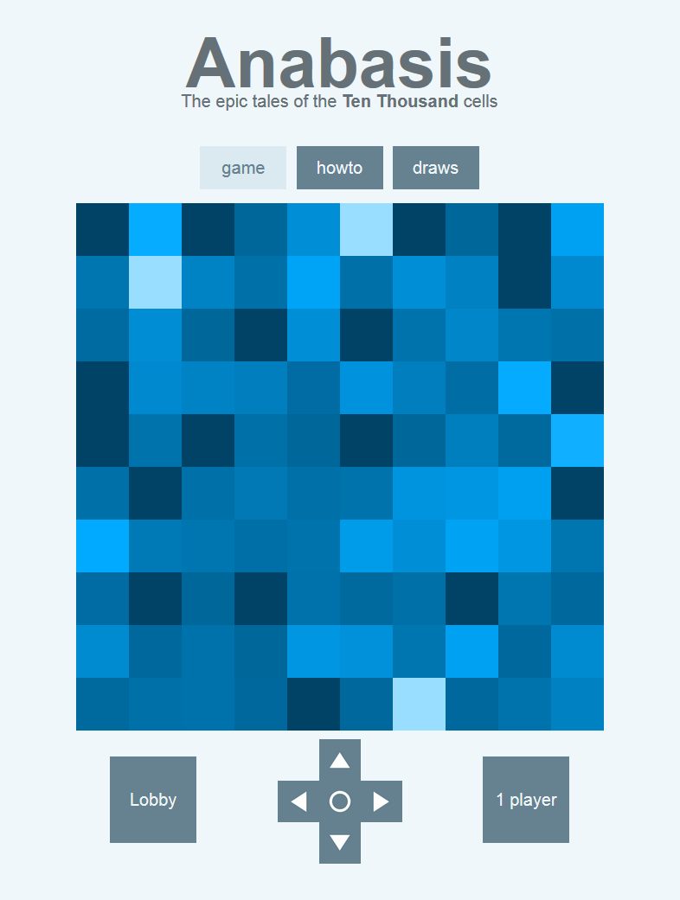
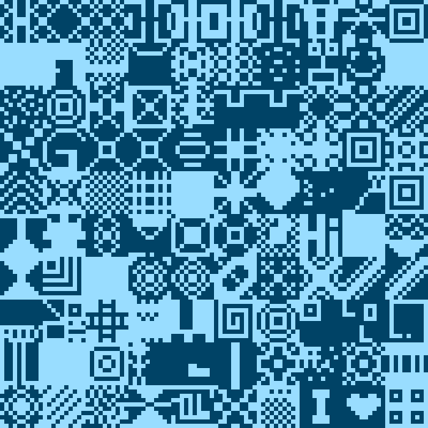

# Anabasis

**Anabasis** is a collaborative webapp game where players draw pictures and try to find one special cell among ten thousand.

*Artistic aim.* The main goal is to draw monochrome pixel pictures. Express yourself and draw letters, signs or geometric forms... Play alone or with friends: every player contributes at the same time on the same drawing!

*Challenging aim.* The secondary goal, more challenging, is to find one special cell among the Ten Thousand. This special cell ends the game and makes you choose the name of the whole draw!

*Draws section.* The finished artworks are therefore available in the draws section.

The app has been released at this address: <a href="https://anabasis.herokuapp.com" target="_blank">anabasis.herokuapp.com</a> (the loading may take some seconds).

  

It is a side project, interrogating myself on where people would prefer to click in such an area. This project uses node.js and mongodb. I deployed the app with <a href="https://www.heroku.com" target="_blank">Heroku</a> and <a href="https://mlab.com" target="_blank">MongoLab</a>. You can check out the <a href="https://ahstat.github.io/Anabasis/" target="_blank">related post on my blog here</a>.

The following image is a drawing obtained with Anabasis, finished on 2 Apr 2015 and called "FINALLY". You can see all drawings by clicking the image [NSFW, some users having a propensity to draw weird stuff].

  

Some technical informations:

* How to load the app:
  * npm install // install dependencies and create node_modules
  * mongod // launch mongo server
  * node app.js // launch app
  * SIDE=10 node app.js // launch app with env variable SIDE set to 10
  * foreman start web // connection to localhost, OR
  * localhost:5000 // another way to connect to localhost (in a web browser)
  * mongo // manage database

* What the player can emit:
  * connection and disconnection
  * From draw.js
    * socket.emit('draw_num_recent');
    * socket.emit('draw_num', num_pic + number); //parseInt then test if NaN and check if negative or too high.
  * From game.js
    * socket.emit('game');
    * socket.emit('lobby');
    * socket.emit('room', id_table); //parseInt (then int or NaN). To be OK, must not be NaN, must not be negative or >= SIDE*SIDE.
  * Critical game.js functions (write to mongodb)
    * socket.emit('new_seen_cell', {id_table: id_table, id_cell: parseInt(this.id)}); //parseInt for 'new_seen_cell' variables (then int or NaN). To be OK, must not be NaN, must not be negative or >= SIDE*SIDE.
    * socket.emit('send_nickname', nickname); // check for string, then ent encode.

* Quick functions for mongo:
  * use mydb
  * find
    * db.attempts.find()
    * db.attempts.find().forEach(printjson); // print all
    * db.wins.find()
    * db.nicknames.find()
    * db.passes.find()
    * db.bans.find()
  * remove
    * db.attempts.remove()
    * db.wins.remove()
    * db.nicknames.remove()
    * db.passes.remove()
    * db.bans.remove()

* The game can also be launched with side of 26 instead of 10. Proceed as follows:
  * change env variable SIDE to 26 (used in app.js)
  * Use index26.html instead of index.html
  * Use draws26.html instead of draws.html